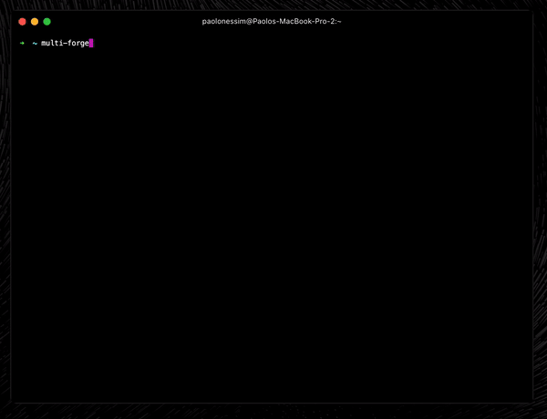

<h1 align="center">MultiForge CLI</h1>

<p align="center">
  <a href=""><strong>Demo Video</strong></a> ·
  <a href="#key-features-and-whats-coming-soon"><strong>Features</strong></a> ·
  <a href="#supported-packages-frameworks"><strong>Supported Frameworks</strong></a> ·
  <a href="#installation"><strong>Installation</strong></a> ·
  <a href="#contributing"><strong>Contributing</strong></a>
</p>
<br/>



<br/>

> **Note**: I built this project as a quick weekend side project, so it's still a **work in progress**. I’ll be adding more features and fixing bugs. If you have any cool ideas, **feel free to contribute**. Let’s make this project awesome together!

## What’s MultiForge CLI?

**MultiForge CLI** is a powerful command-line tool for quickly building full-stack apps across multiple frameworks. With built-in templates, customizable workflows, and effortless package integration, it streamlines your development process and supports popular frameworks like Next.js (with more coming soon).

## Key Features (and what’s coming soon)

-   **Multi-Framework Support**: Currently supports **Next.js**, with plans to add **Remix** and **Laravel** soon, so you can easily switch between different frameworks for your projects.
-   **Effortless Package Integration**: Add important packages to your project and adjust them to match your coding style. Whether it's configurations or how things are set up, MultiForge adapts to the way you like to code.
-   **Templates**: Create your own templates or use built-in ones to kick-start your projects. You can also pull remote templates from GitHub or local directories, giving you flexibility in how you start your projects.
-   **Highly Customizable**: Full control over everything! Modify package setups, templates, and configurations to match your unique needs and workflow. MultiForge is designed to fit how you like to work.

## Installation

You can install **MultiForge** globally using npm:

```bash
npm install -g multiforge
```

Or with Yarn:

```bash
yarn global add multiforge
```

## How to Use

Once installed, just type **MultiForge** in your terminal to get started:

```bash
multi-forge
```

## Commands

-   `multi-forge` - Start a new project.
-   `multi-forge add (Coming Soon)` - Add a package to your project (Coming Soon)

## Supported Packages / Frameworks

> Right now, **MultiForge** only supports **Next.js** since I had limited time to work on it. But more frameworks like **Remix** and **Laravel** are on the way! I’m also planning to add more packages and features to make it even more powerful.

-   **Next.js**: The React framework for building websites.
-   **Remix (Coming Soon)**: A modern web framework for building web apps.
-   **Laravel (Coming Soon)**: A PHP framework for building web apps.

## Packages / Integrations

Boost your project with these features:

### **ORM (Object-Relational Mapping)**

-   **Drizzle-ORM**: Lightweight ORM for easy querying.
-   **Prisma**: Type-safe ORM with powerful query capabilities.

### **Authentication**

-   **Auth.js (Coming Soon)**: Simple and flexible authentication.
-   **Clerk**: Full user management with built-in authentication.
-   **Lucia (Coming Soon)**: Lightweight auth for web apps.
-   **Kinde (Coming Soon)**: A developer-friendly auth platform.

### **Component Libraries**

-   **Shadcn UI**: Flexible UI components based on Radix.
-   **Chakra-UI**: Simple, modular, and accessible component library.

### **Emails**

-   **Mailgun (Coming Soon)**: Send transactional and bulk emails.
-   **Resend (Coming Soon)**: Simple API for sending emails at scale.

### **Payment Integration**

-   **Stripe (Coming Soon)**: Popular platform for handling payments.
-   **Lemon Squeezy (Coming Soon)**: Sell digital products with built-in payment support.

### **Analytics**

-   **Google Analytics**: Track website traffic and user behavior.
-   **Vercel Analytics**: Real-time analytics tailored for Vercel.

---

## Contributing

I’d love your help! Check out our [contribution guidelines](CONTRIBUTING.md) for more info on how to get involved.

## License

This project is licensed under the MIT License. Check out the [LICENSE](LICENSE) file for more details.
